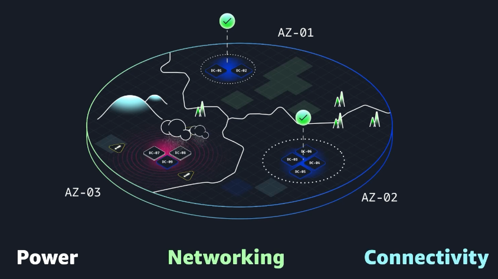

# Introduction to AWS Global Infrastructure

**AWS Regions & Availability Zones**
- **Regions** are geographic areas (e.g., Paris, Tokyo, Ohio) that host multiple isolated data centers.
- Each Region contains **3+ Availability Zones (AZs)**, which are separate data center clusters with independent power, networking, and connectivity.

**High Availability & Fault Tolerance**
- **High availability** ensures applications stay accessible with minimal downtime; if one component fails, another takes over.
- **Fault tolerance** goes further, allowing the system to keep operating even when multiple components fail.
- Distributing resources across multiple AZs (and eventually across Regions) provides redundancy and resilience against outages, natural disasters, or hardware failures.

**Why it matters**
- Guarantees continuous service for customers, protecting revenue and user experience.
- Enables businesses to run disaster‑proof architectures by leveraging AWS’s global, isolated infrastructure.

*In later lessons you will learn how to architect multi‑Region deployments and automated failover strategies.*