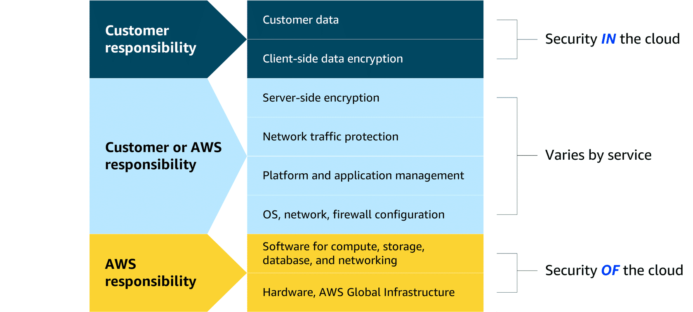

# AWS Shared Responsibility Model

**Key Concepts**
- **Shared responsibility**: Security is a joint effort – AWS secures the *cloud* (infrastructure), you secure the *in‑cloud* (your workloads, data, OS, applications).
- **AWS responsibilities** (Security *of* the cloud):
  - Physical data‑center security, power, HVAC.
  - Network infrastructure and isolation.
  - Hypervisor and virtualization layer.
- **Customer responsibilities** (Security *in* the cloud):
  - Operating system patching and configuration.
  - Application security and hardening.
  - Data protection – encryption, access controls, IAM policies.
  - Managing keys, credentials, and user permissions.

**Why it matters**
- Understanding the model helps you apply the right controls at each layer.
- Responsibility can shift depending on the AWS service (e.g., managed services reduce your operational burden).
- Proper division of duties ensures a secure, compliant, and trustworthy cloud environment.

*Think of it like a house: AWS builds and secures the walls and roof, while you lock the doors and protect your valuables inside.*