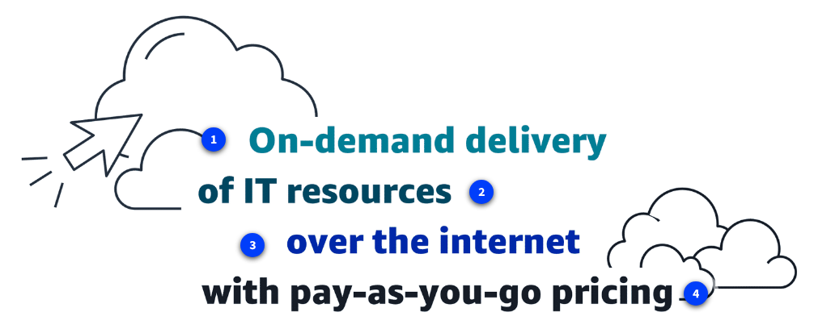
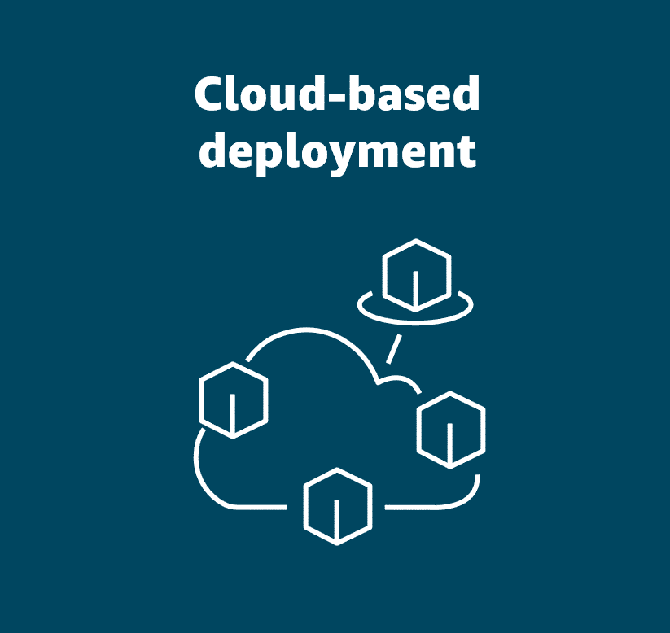
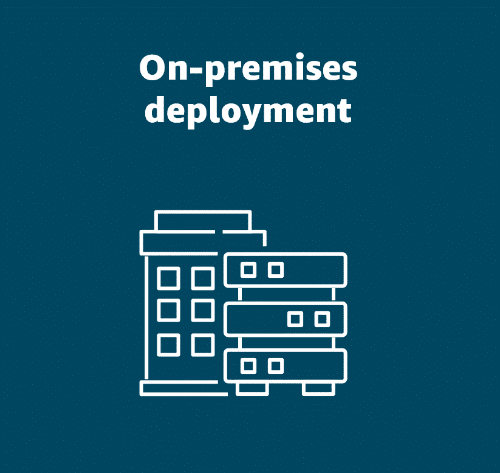
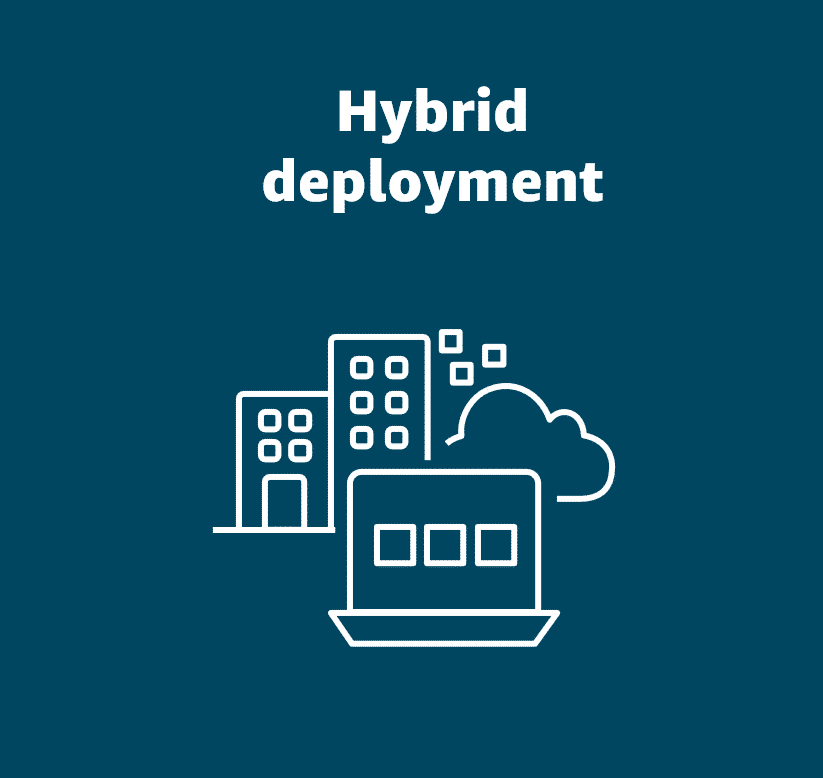

# Cloud Computing Overview

- **Definition**: Cloud computing is the on‑demand delivery of IT resources (compute, storage, databases, networking, AI/ML tools, etc.) over the internet with a pay‑as‑you‑go pricing model.
- **Key Benefits**: No upfront hardware costs, automatic scaling, remote access from anywhere, and reduced operational overhead.
- **Historical Context**: Originated from Amazon’s internal infrastructure needs; AWS launched its first service in 2004 and has since become a global cloud leader.
- **Deployment Types**:
  - **Cloud‑based** – resources fully hosted in a cloud provider.
  - **On‑premises** – resources run in a private data center.
  - **Hybrid** – a mix of cloud and on‑premises resources, often used for legacy or regulatory reasons.

  
  
  

- **Core Concepts**: On‑demand provisioning, internet‑based access, and flexible, usage‑based pricing.

This summary captures the essential ideas you need to remember about cloud computing.
